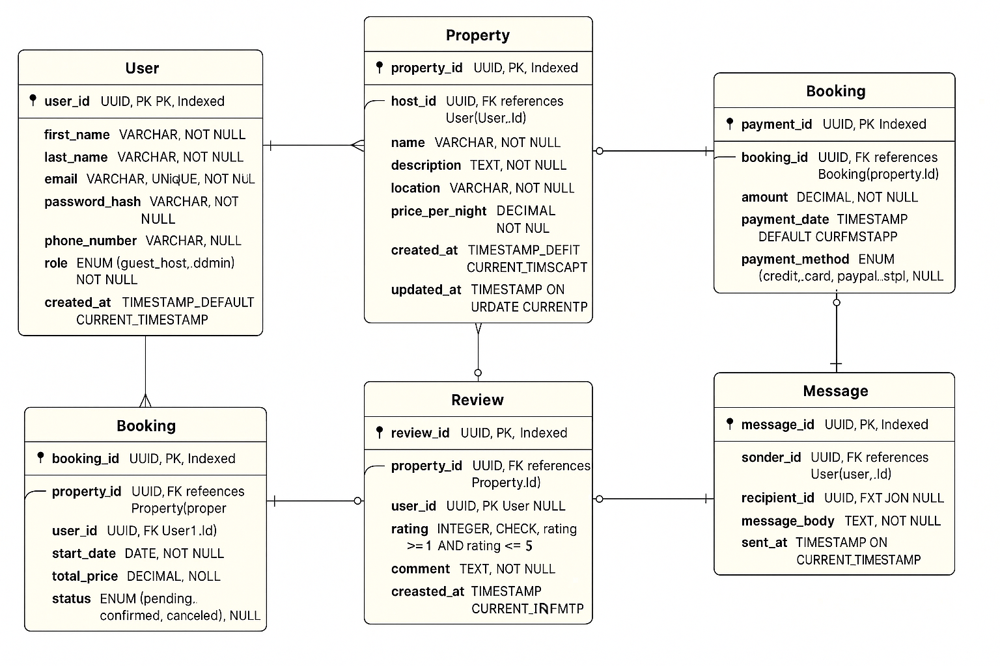

# Database Structure Overview

## Introduction

This document outlines the structure of a relational database designed for a property rental platform. The schema manages users, properties, bookings, payments, reviews, and messaging between users. It is normalized to **Third Normal Form (3NF)** to ensure data integrity, eliminate redundancy, and support efficient data management.

---

## Entity Overview

### 1. **User**
Represents the users of the platform, which include guests, hosts, and admins.

- **Primary Key:** `user_id` (UUID)
- **Attributes:**
  - `first_name`, `last_name`: User's personal information
  - `email`: Unique identifier for login
  - `password_hash`: Securely stored password
  - `phone_number`: Optional contact information
  - `role`: ENUM with values `guest`, `host`, or `admin`
  - `created_at`: Timestamp of user creation

---

### 2. **Property**
Represents a rental property listed by a host.

- **Primary Key:** `property_id` (UUID)
- **Foreign Key:** `host_id` references `User(user_id)`
- **Attributes:**
  - `name`, `description`, `location`: Details of the property
  - `pricepernight`: Cost per night
  - `created_at`, `updated_at`: Timestamps for tracking changes

---

### 3. **Booking**
Captures information about reservations made by guests for specific properties.

- **Primary Key:** `booking_id` (UUID)
- **Foreign Keys:**
  - `property_id` references `Property(property_id)`
  - `user_id` references `User(user_id)`
- **Attributes:**
  - `start_date`, `end_date`: Duration of the booking
  - `total_price`: Total cost calculated for the stay
  - `status`: ENUM with values `pending`, `confirmed`, or `canceled`
  - `created_at`: Booking creation timestamp

---

### 4. **Payment**
Tracks payments made for bookings.

- **Primary Key:** `payment_id` (UUID)
- **Foreign Key:** `booking_id` references `Booking(booking_id)`
- **Attributes:**
  - `amount`: Payment total
  - `payment_method`: ENUM with values `credit_card`, `paypal`, `stripe`
  - `payment_date`: Timestamp of the transaction

---

### 5. **Review**
Stores feedback left by guests on properties they’ve stayed in.

- **Primary Key:** `review_id` (UUID)
- **Foreign Keys:**
  - `property_id` references `Property(property_id)`
  - `user_id` references `User(user_id)`
- **Attributes:**
  - `rating`: Integer between 1 and 5
  - `comment`: User feedback
  - `created_at`: Timestamp of review submission

---

### 6. **Message**
Facilitates communication between users (e.g., guest and host).

- **Primary Key:** `message_id` (UUID)
- **Foreign Keys:**
  - `sender_id` references `User(user_id)`
  - `recipient_id` references `User(user_id)`
- **Attributes:**
  - `message_body`: Text of the message
  - `sent_at`: Timestamp of when the message was sent

---

## Indexing and Constraints

- **Primary keys** are automatically indexed.
- **Additional Indexes:**
  - `email` in `User`
  - `property_id` in `Property` and `Booking`
  - `booking_id` in `Booking` and `Payment`

- **Constraints:**
  - `email` is unique in `User`
  - `rating` in `Review` is constrained to 1–5
  - Foreign key constraints ensure relational integrity

---

## Normalization

The schema has been reviewed and adheres to **Third Normal Form (3NF)**:
- No repeating groups (1NF)
- No partial dependencies (2NF)
- No transitive dependencies (3NF)

This normalization ensures:
- Data consistency
- Elimination of redundancy
- Efficient update operations

---

## Conclusion

The database design is scalable and well-suited for a rental platform, supporting core features like user management, property listings, bookings, transactions, user communication, and reviews. Through strong normalization and well-defined relationships, the structure ensures robust data integrity and streamlined performance.

